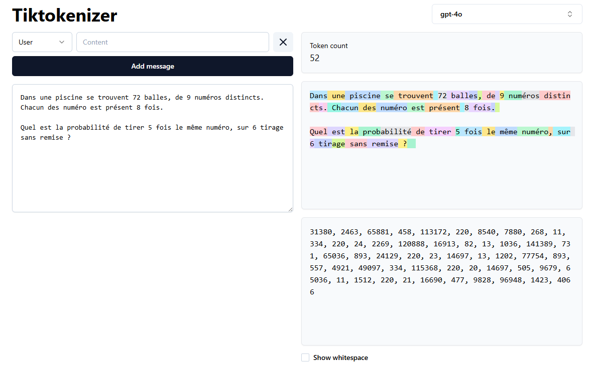
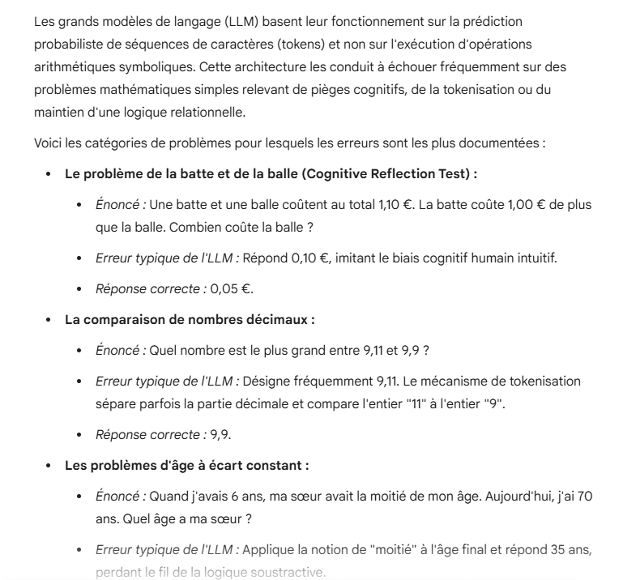

1. Kahoot (WookLap) - question au début :
    1. Est-ce que vous utilisez des outils IA ? 
       1. Oui
       2. Non
    2. Cadre 
       1. perso ? 
       2. Pro ? 
       3. Les deux ? 
    3. Quels outils ? 
       1. ChatGPT, 
       2. Gemini, 
       3. Claude,  
       4. DeepSeek,
       5. Mistral, 
       6. BoxIA, 
       7. NotebookLM, 
       8. Grammarly, 
       9. Perplexity, 
       10. Reverso, 
       11. DeepL, 
       12. Google Trad, 
       13. Autres
    4. Abonnement pro / premium ?
       1. Oui abonnement
       2. Non
    5. Quel besoin / utilité :  
       1. Traduction
       2. Compréhension documents
       3. Rédaction (rapport, mails, ...)
       4. Résumé de message / documents / recherche internet (Apple Intelligent, Copilot Search)
       5. Planification, organisation (vacances, cuisine, programme sport...)
       6. Chat perso (avis, psy, questionnement...)
    6. Souveraineté des outils:
       1. J'utilise toujours des outils souverain et je paye pour ça
       2. J'utilise des outils souverain, mais je ne paye pas pour ça
       3. J'utilise des outils non souverain, et je paye pour ça
       4. J'utilise des outils non souverain, et je ne paye pas pour ça
    7. Qui est plus polluant ? Mail vs Requête chatbot ? 
       1. Mail est plus polluant
       2. Requête chatbot est plus polluant
    8. Lorsqu'une IA répond, a quel point vous faites confiance à l'IA ? 
       1. Slide pour quantifier la confiance (0-100%)
    9.  Quel est la consommation actuelle Electricité pour les datacenter en France (dans le monde) en % 
        1.  Slide pour quantifier la consommation (0-100%)


# Point à aborder non encore traité: 
 

1. Détournement de l'usage, et problèmes connu: 
    En tant que professionnel on est identifié en tant qu'expert etc. Donc si on utilise ChatGPT, et que cela se voit, on peut douter de notre crédibilité. Personnellement, lorsque je vois une utilisation manifeste de l'IA, je ne cherche plus à lire, je ne crois plus le document. 
   - Exemple d'un cas au US où il perd sa license d'avocat qui a été généré par IA.
   - Papier de recherche sur l'analyse statistique des mots générée, ou la richesse du texte est un indicateur. On se rend compte qu'un texte généré par IA est finalement peu riche en vocabulaire. 
   - Génère donc des LLM avec des biais. 
     - Exemple avec la justice raciste. 
    - Papier de recherche sur: Génère des réponses associées à un échantillon très précis: celui d'un riche occidentale de la silicon valley. Finalement, le LLM améliorer notre réponse (la rendant plus "experte", finie par l'appauvrir).


2. Usage massif dans le monde de l'IA générative:
   - D'après [Graphite](https://graphite.io/five-percent/more-articles-are-now-created-by-ai-than-humans)  un plus de 50% du contenu disponible aujourd'hui est du contenu généré par IA 
   - Augmentation du flux d'information (exponentiel ?), entre reals instagram / tiktok / short youtube, les articles de blogs, les papiers de recherche scientifique (même nombre de PhD et pourtant nombre de papier en augmentation)

3. Loi d'échelle : 
   - Toujours plus de data (slide SDD)
   - Des modèles toujours de plus en plus gros
   - Quelles limites hardware ? 
   - Quels coût écologique (eau, CO2, terre rare ...)

4. Problème et question de société :
   - Si l'IA est censé nous faciliter le travail et nous enlever les taches gourmande, en fait on est beaucoup plus productif, et cela génère un flux d'information démentiel. Ce flux est ensuité cnosommé, alors au lieu de nous faliciter la tâche, il fini par nous en rajouter à des échelles que l'on ne peut gérer.
   - Disparition de certains secteur ? Papier de recherche entre métier que l'on pensait être impacté, et métier réellement impacté par l'IA gen.  [ai-and-the-future-of-work](https://www.cognizant.com/us/en/aem-i/ai-and-the-future-of-work-report#:~:text=Today%E2%80%94six%20years%20ahead%20of%20schedule%E2%80%9493%25%20of%20jobs%20could,and%20to%20a%20greater%20extent%20than%20we%20anticipated).


## IA et IA Gen:
Intelligence Artificielle (IA) :
  - Machine Learning (ML) 
    - Deep Learning (DL) 
      - IA Générative (LLMs, Diffusion Models, ...)
        - ChatGPT, Dall-E
      - Autres modèles de DL (CNN, RNN, ...)
    - Autres modèles de ML (SVM, Random Forest, ...) 


Idée: résoudre des tâche qui nécessite l'intelligence humaine (raisonnement, perception ...)

source: [https://www.youtube.com/watch?v=xdDKq59MaxU](https://www.youtube.com/watch?v=xdDKq59MaxU)

De 1960-1990: on parle plutôt de 'system experts':
  - Système expert: 
    - Basé sur des représentations symboliques de la connaissance, et des déductions/assertions logiques, desquels on pourrait déduire des connaissances.
    - Exemple: 
       - MYCIN (1970s): système expert pour aider les médecins à faire des diagnostics. 
       - Deep Blue (1997): programme pour analyser les meilleurs coup d'échecs
       - Outils d'aide à la décision pour les entreprises
       - Traduction automatique ...

    - Limite: 
      - Ne gère pas les tâches complexe qui font exploser le nombres de règles et d'exceptions.
        - Cela donne lieu à "l'hiver de l'Intelligence Artificielle".

De 1990 à aujourd'hui: apprentissage statistique 
- Réseaux de neurones, dont les performances on explosé et ne cessent d'exploser:
  - D'abord la reconnaissance de visages aussi bien qu'un humain (Backpropagation Rumelhart (1986), CNN LeCun (1989, 1998), AlexNet (2012))
  - Le language (Attention is all you need, 2017, ChatGPT (2022))
  - Les raisonnement (Chain of thought (2022), Chain-of-Verification (CoVe, 2023))

Comment ?
- Big Data 
- Capacité de calcul 

# Quelques ordre de grandeurs: 
## Machine Learning Hardware et capacité de calcul
#### Capacité de calcul des GPUs (AI chip):
- Multiplié par 1.6 tout les an -> x10 tout les 5 ans
- [https://epoch.ai/data/machine-learning-hardware/?view=graph](https://epoch.ai/data/machine-learning-hardware/?view=graph)

  
#### Capacité de calcul cummulé dans le monde:
  - Double tout les 7 mois 
  - [https://epoch.ai/data-insights/ai-chip-production/](https://epoch.ai/data-insights/ai-chip-production/)

  
#### Capacité de calcul cummulé de GPU NVIDIA par génération:  
  - Les GPU de fin 2020 (Volta) représentent en cumulé de 1.1e20 FLOP/s. 
    - En fin 2024, les GPU dernière génération (Hopper) représente 3e21 FLOP/s, soit 30 fois plus de puissance de calcul en 4 ans seulement.
  - Donnée provenant des performances GPU (FP16 FLOP/s), et de donnée publique sur les Data centers et leur compistion en GPU 


# Principes de fonctionnement des LLMs:

## Principes de base:
### Token 
- Ne fais pas de calcul, mais fait une prédiction à partir d'une séquence de tokens. 
- Le textes sont gérés comme une succession de tokens dans une séquences.
    - Exemple avec [https://tiktokenizer.vercel.app/](https://tiktokenizer.vercel.app/)
    <!-- - récupération d'une image dans plot/tokenisation.png -->


## Ordres de grandeurs  
#### Taille de contexte et token de sortie LLMs:
  - La taille des token de sortie double tout les ans pour les LLM classiques, ils quintuple pour les modèles de raisonnement.
  - La taille de token de sortie des modèles de raisonnement est 10 fois plus grande que les modèles classiques.
  - https://epoch.ai/data-insights/output-length/ 

----

## Limites connues de LLMs, et évolution de ces limites:

### Qu'est-ce que l'IA sait faire ? 
- Classification / Clustering 
  - Distinguer des donnée 
  - Regrouper des données similaires 
- Regression 
  - Faire de la prédiction 
- Réduction de dimension 
  - Simplification des données (ex: PCA) 
- Détection d'objet: 
  - Identifier des objet dans une image
  - Identifier une voix dans un enregistrement audio
- Segmentaition 
  - Détourer un objet dans une image, savoir la place qu'il prend (ex en mobilité YOLO)
- Détection d'anomalies
  - Incident, pannes, risque de séucrités...
  - Maintenant prédictive: prédire une problème avant qu'il arrive à partir de signaux faibles
### Quelles limites connues :
- Conscience propre
- Compréhension émotionnelle
  - Analyser et interpréter des émotion à partir d'un timbre de voix, une attitude ...
- Compéhension contextuelle: capacité à comprendre le contexte dans lequel on est en une fraction de seconde. 
- Intuition profonde: capacité à déroger aux règles les plus logiques.
  - Utilisé en RL (forcer le Robot à faire des actions qui ne sont pas les plus probable pour forcer l'exploration)
- Jugement autonome: faire des choix et décisions de manière autonome
- Créativité vs Génératif

### Macaroning prompting 
- Perroquet / Papagei / loro / Parrot


###  math et logique: 
- Jusqu'à il y a peu, les LLMs avaient des problèmes à gérer des problèmes simples car les LLM faisait apparraitre des relations sémantiques, mais sans gestion de "logique", de relation entre les éléments. Aujourd'hui, c'est quelque chose de largement améliorer. Mais lorsqu'on pose la question à un LLM `Quels sont les problèmes de maths simples connu pour lesquels un chatbot type chatGPT ou Gemini, se trompe très souvent ?`, ils répondent avec de nombreux problèmes de math simple, où aucun LLM ne se trompe jamais...
{style="border: 2px solid black;"}


Limites des LLMs pour des calculs de math: 
- Exemple de réponse des LLMs pour une même question de math de combinatoire, mais selon le modèle sélectionné: 
A la question: 

`Dans une piscine se trouvent 72 balles, de 9 numéros distincts. Chacun des numéro est présent 8 fois. Quel est la probabilité de tirer 5 fois le même numéro, sur 6 tirage sans remise ?`

Réponse: 
Choix de 6 parmi 72:
$\binom{72}{6} = \frac{72!}{6!(72-6)!} = 158 439 456$
Choix de 5 balles parmi les 8 portant le même numéro :
$\binom{8}{5} = 56$
Choix de la dernière balle restante parmis les 72-8 autres balles: 
$\binom{64}{1} = 64$

D'où :
$P = \frac{9 \times 56 \times 64}{158 439 456} = 2.035e-4$

#### Gemini Rapide retourne: 
::: {style="border: 2px solid black;"}
Pour calculer la probabilité de tirer exactement 5 fois le même numéro sur 6 tirages sans remise, il convient d'utiliser la loi hypergéométrique.

**1. Structure du calcul**
Le problème consiste à choisir un numéro spécifique parmi les 9 disponibles, puis à calculer la probabilité d'obtenir 5 exemplaires de ce numéro et 1 exemplaire parmi les 64 autres balles restantes.

* **Nombre total de combinaisons possibles** : Tirer 6 balles parmi 72.
    $$\binom{72}{6} = \frac{72!}{6!(72-6)!} = \color{red}{171\,513\,432}$$
* **Nombre de numéros favorables** : Il y a 9 numéros distincts qui peuvent être le numéro répété.
* **Nombre de combinaisons pour un numéro spécifique** :
    * Choisir 5 balles parmi les 8 portant ce numéro : $\binom{8}{5} = 56$
    * Choisir 1 balle parmi les 64 autres balles : $\binom{64}{1} = 64$

**2. Formule de la probabilité**
La probabilité $P$ est définie par le rapport entre le nombre de cas favorables et le nombre total de cas possibles :

$$P = \frac{9 \times \binom{8}{5} \times \binom{64}{1}}{\binom{72}{6}}$$

**3. Résultat numérique**
* **Cas favorables** : $9 \times 56 \times 64 = 32\,256$
* **Calcul final** :
    $$P = \frac{32\,256}{\color{red}171\,513\,432} \approx 0,00018806$$

La probabilité est d'environ **0,0188 %**, soit environ **1 chance sur 5 317**.
::: 

#### Gemini Raisonnement retourne: 
::: {style="border: 2px solid black;"}
Pour calculer la probabilité de tirer exactement 5 fois le même numéro sur 6 tirages sans remise, la démarche utilise l'analyse combinatoire.

**1. Calcul du nombre total de tirages possibles**
Le nombre total de façons de choisir 6 balles parmi 72 est donné par la combinaison :
$$\binom{72}{6} = \frac{72!}{6!(72-6)!} = 157\,753\,320$$

**2. Calcul du nombre de cas favorables**
Pour obtenir exactement 5 fois le même numéro, il faut :
* **Choisir le numéro concerné** : il y a 9 numéros distincts possibles.
* **Choisir 5 balles parmi les 8 de ce numéro** : soit $\binom{8}{5}$.
* **Choisir la 6ème balle** parmi les balles ayant un numéro différent (pour ne pas en avoir 6 du même numéro) : il reste $72 - 8 = 64$ balles.

Le nombre de cas favorables est :
$$9 \times \binom{8}{5} \times \binom{64}{1}$$
$$9 \times 56 \times 64 = 32\,256$$

**3. Calcul de la probabilité**
La probabilité $P$ est le rapport des cas favorables sur le nombre total de tirages :
$$P = \frac{32\,256}{\color{red}157\,753\,320}$$

En simplifiant la fraction ou en effectuant la division :
$$P \approx 0,00020447$$

Soit environ **0,0204 %**.
:::

#### Gemini Pro retourne: 
::: {style="border: 2px solid black;"}
**Analyse du modèle probabiliste**

Le problème s'apparente à un tirage sans remise de 6 éléments parmi un ensemble de 72 éléments. L'ordre de tirage n'a pas d'importance, il convient donc d'utiliser les combinaisons. 

L'expression "tirer 5 fois le même numéro" peut être interprétée strictement (exactement 5 occurrences) ou au sens large (au moins 5 occurrences, ce qui inclut 6 occurrences). Les deux scénarios sont calculés ci-dessous par rigueur méthodologique.

**1. Calcul du nombre total d'issues possibles**

Le nombre total de combinaisons de 6 balles parmi 72 est :
$$C_{72}^6 = \binom{72}{6} = \frac{72!}{6!(72 - 6)!} = \color{red}156\,238\,908$$

**2. Calcul des cas favorables pour exactement 5 balles identiques**

Pour obtenir exactement 5 fois le même numéro, il faut :
* Choisir le numéro qui sera répété 5 fois parmi les 9 disponibles : $\binom{9}{1} = 9$ possibilités.
* Choisir 5 balles parmi les 8 balles portant ce numéro : $\binom{8}{5} = 36$ possibilités. *(Correction : $\binom{8}{5} = \frac{8 \times 7 \times 6}{3 \times 2 \times 1} = 56$)*.
* Choisir la 6ème balle parmi les autres numéros restants, soit 64 balles (72 total - 8 balles du numéro déjà choisi) : $\binom{64}{1} = 64$ possibilités.

Le nombre de cas favorables pour exactement 5 balles est :
$$9 \times 56 \times 64 = 32\,256$$

**3. Calcul des cas favorables pour exactement 6 balles identiques**

Pour obtenir 6 fois le même numéro :
* Choisir le numéro répété 6 fois : $\binom{9}{1} = 9$ possibilités.
* Choisir 6 balles parmi les 8 portant ce numéro : $\binom{8}{6} = 28$ possibilités.

Le nombre de cas favorables pour exactement 6 balles est :
$$9 \times 28 = 252$$

**Résultats**

* **Probabilité d'obtenir exactement 5 fois le même numéro :**
$$P(X=5) = \frac{32\,256}{156\,238\,908} = \frac{384}{1\,859\,987} \approx 0,000206 \text{ (soit environ 0,0206 \%)}$$

* **Probabilité d'obtenir au moins 5 fois le même numéro (5 ou 6 fois) :**
$$P(X \ge 5) = \frac{32\,256 + 252}{156\,238\,908} = \frac{32\,508}{156\,238\,908} = \frac{387}{1\,859\,987} \approx 0,000208 \text{ (soit environ 0,0208 \%)}$$
:::

#### ChatGPT (gratuit) retourne:
::: {style="border: 2px solid black;"}
On modélise ça avec un tirage **sans remise** → loi hypergéométrique.

**Étape 1 : Nombre total de tirages possibles**

On choisit 6 balles parmi 72 :
$
\binom{72}{6}
$

**Étape 2 : Cas favorables (exactement 5 balles du même numéro)**

* Choisir le numéro concerné : (9) façons
* Choisir 5 balles parmi les 8 de ce numéro : ($\binom{8}{5}$)
* Choisir la 6ᵉ balle parmi les autres (il reste (72 - 8 = 64) balles) : (64)

Donc :
$$
\text{favorables} = 9 \times \binom{8}{5} \times 64$$

**Étape 3 : Probabilité**

$$
P = \frac{9 \times \binom{8}{5} \times 64}{\binom{72}{6}}$$

On simplifie :

* $\binom{8}{5} = 56$

* $
P = \frac{9 \times 56 \times 64}{\binom{72}{6}} = \frac{32256}{\binom{72}{6}}
$

**Valeur numérique**

$
\binom{72}{6} \approx \color{red}{156,236,111}
$

$
P \approx \frac{32256}{\color{red}156,236,111} \approx 0.000206$

**Résultat final**

$
\boxed{P \approx 0.0206\%}
$

👉 C’est donc **très peu probable** (environ 1 chance sur 4 850).

Si tu veux, je peux aussi te montrer la probabilité d’avoir *au moins* 5 identiques, ou comparer avec un tirage avec remise 👍
:::

### Sycophancy 
- Sycophancy ([https://arxiv.org/pdf/2505.13995](https://arxiv.org/pdf/2505.13995))
  - Analyse à partir de conversation reddit  
  - Am I the asshole (AITA) / NTA (Not the asshole) / YTA (You're the asshole) / FLIP( Flipped perspective): 
  - 
  - 

###  Hallucination, Incohérence
Exemple de vidéo pédagogique sur l'histoire, qui semble cohérente car répond à nos stérotype de représentartion de certaines période, mais est en réalité truffée d'anachronisme et d'erreur...

](plot/yanntoutcourt_histoire.mp4)


### Texte généré par IA et crédibilité:
- En tant qu'établissement publique, il est important de veiller à ce que les informations diffusées soient fiables et vérifiées.
- Je pense qu'il ne faut pas "ne pas utiliser d'outils", mais il faut:
  -  à minima vérifier les informations générées qui sont très souvent éronnées, incomplètes, ou de sens très limité.  
  -  Supprimer les marqueurs d'IA Gen.

#### Marqueurs d'IA Gen:
**Marqueurs grossiers:**


**Emoji, caractère spéciaux, formulation:**

- Utilisation excessive d'emojis (fusées 🚀, flamme 🔥, coche ou check mark ✅, cible 🎯, graphiques "📈", "📊",...)

**Très (trop) structuré:** 

- Introduction, développement, conclusion. Ne ressemble pas à des écris humains, nottamment pour des écris qui ne demandent pas autant de structure (ex: commentaire en ligne). A tendance à sur-expliquer même des éléments très simples.

**Formulation dénué de sens**

- Utilisation de formulation qui semblent cohérente à la première lecture, mais dont le sens est limité voir eronné 
- Un vocabulaire creux. On lira facilement des "point cruciaux", "éléments clés", "point critique" 
- A tendence à suivre des stéréotypes grossiers. Exemple pour une expertise sur le domaine des mobilités, il renverras énormément de termes qui sont dans le champs lexical de la mobilité, mais qui ne sont pas nécéssaire ni pertinent pour le sujet traité.

## L'IA ne sait pas faire, et ne saura jamais faire quelque chose ? 
A chaque avancé, on pensait que l'IA ne saurait jamais faire certaines choses et qu'elle était très limitée par construction. Et pourtant, à chaque fois, des avancées on permis de dépasser en partie ou complètement ces limites (ex: reconnaissance d'image, langage, raisonnement, math, ...). 

-----


# Limites de token d'entrée : 

```{python}
#| label: map-generation
#| echo: false
# https://developers.openai.com/api/docs/models/ 
# https://benchable.ai/models/openai/gpt-3.5-turbo-1106
# https://en.wikipedia.org/wiki/GPT-3  (nb token entrée GPT3)
# https://mattrickard.com/the-context-length-observation  (context length of GPT1, 2, 3, 3.5, 4)
import json 
import pandas as pd
import bokeh 
from bokeh.plotting import figure, show
from bokeh.models import ColumnDataSource, HoverTool, CustomJSTickFormatter, ColorBar, Legend, LegendItem
import numpy as np
from bokeh.transform import linear_cmap
from bokeh.plotting import output_notebook

json_path = 'chatbot_context_token_date.json'
json_file = json.load(open(json_path))

df = pd.DataFrame(json_file).T

def convert_size(size_str):
    if size_str.endswith('K'):
        return int(float(size_str[:-1]) * 1e3)
    elif size_str.endswith('M'):
        return int(float(size_str[:-1]) * 1e6)
    elif size_str.endswith('B'):
        return int(float(size_str[:-1]) * 1e9)
    elif size_str.endswith('T'):
        return int(float(size_str[:-1]) * 1e12)
    elif size_str == "None":
        return -1
    else:
        return int(size_str)

def get_size(parameters,maxi):
    if parameters is None:
        return 3
    elif parameters == -1:
        return 3
    else:
        return np.sqrt(parameters)/np.sqrt(maxi)*50#(np.log10(parameters)/np.log10(maxi))*20# (np.log10(parameters)-7)*3

palette = list(reversed(bokeh.palettes.YlOrRd7))
size_col = 'int_parameters'
df['int_parameters'] = df['expected_parameters'].apply(lambda x: convert_size(x))
df['int_context_length'] = df['context_length'].apply(lambda x: convert_size(x))
df['int_max_tokens'] = df['max_tokens'].apply(lambda x: convert_size(x))
df['log_max_tokens'] = df['int_max_tokens'].apply(lambda x: np.log10(x) if (x is not None and x != -1) else -1)
df['released'] = pd.to_datetime(df['released'])
df['size'] = df[size_col].apply(lambda x: get_size(x, df[size_col].max()))

source = ColumnDataSource(df)

p = figure(x_axis_type='datetime', 
           title="Evolution taille de context des LLMs", 
           width=800, 
           height=400)

mapper = linear_cmap('int_max_tokens',
                     palette, 
                     df['int_max_tokens'].min(), 
                     df['int_max_tokens'].max())

p.scatter(x='released', 
          y='int_context_length', 
          size='size',
          source=source, 
          fill_color=mapper,
          line_color='#292828', alpha=0.4)

p.yaxis.formatter = CustomJSTickFormatter(code="""
    if (tick >= 1e6) {
        return (tick / 1e6) + 'M';
    } else if (tick >= 1e3) {
        let val = tick / 1e3;
        return val + (val === 100 ? 'k' : 'K');
    } else {
        return tick;
    }
""")

color_bar = ColorBar(color_mapper=mapper['transform'], 
                     orientation='horizontal',
                     title="Max Output Tokens")
p.add_layout(color_bar, 'below')

# legend_items = []
# for val, label in [(1e7, '10M'), (1e9, '1B'), (1e11, '100B')]:
#     dummy_source = ColumnDataSource(dict(released=[pd.NaT], int_context_length=[np.nan]))
#     dummy = p.scatter(x='released', y='int_context_length', size=get_size(val), 
#                       source=dummy_source, line_color='#292828', fill_color='white', alpha=0.4)
#     legend_items.append(LegendItem(label=label, renderers=[dummy]))

# size_legend = Legend(items=legend_items, orientation="horizontal", title="Taille (Paramètres)")
# p.add_layout(size_legend, 'below')

hover = HoverTool(tooltips=[
    ("Model", "@index"),
    ("Parameters", "@parameters"),
    ("Released", "@released{%F}"),
    ("Knowledge Cutoff", "@knowledge_cutoff"),
    ("Context Length", "@context_length"),
    ("Output token", "@max_tokens"),
], formatters={'@released': 'datetime'})

p.add_tools(hover)
output_notebook()
show(p)
```

## Outils IA Gen: 
- chatbot: 
  - ChatGPT (OpenAI)
  - Gemini (Google)
  - Mistral (Mistral)
  - Claude (Anthropic)
  - DeepSeek (DeepSeek)
  - ...
- Outils de génération d'image: 
  - DALL-E (OpenAI)
  - Midjourney (Midjourney)
  - Stable Diffusion (Stability AI)
  - ...
- Outils de génération de code: 
  - Copilot (GitHub/Microsoft)
  - CodeWhisperer (Amazon)
  - CodeGen (Salesforce)
  - ...
- Recherche documentaire: 
  - Elicit (Ought): recherche bibliographique scientifique 
    - Propose une sortie plus "strucutrée", sous forme de rapport ou tableaux csv
    - Long à répondre, et version pro très couteuse
  
  

  - Perplexity (Perplexity AI): recherche web en temps réel et fourni les sources
    - Propose une sortie plus chatbot
    - 
    - 
  
  - NotebookLM (Google): recherche documentaire à partir de nos propres sources. cite explitement les morceaux de texte qui ont été utilisé pour construire la réponse
    - Propose une pluralité de formats de sortie: slides, vidéos, podcast ...
    - 
  - ...
- Correction de texte: 
  - Grammarly (Grammarly): version pro très couteuse, mais fonctionnalités de bases accessible gratuitement et déjà largement suffisante.
  - [https://app.grammarly.com/ddocs/2955389823](https://app.grammarly.com/ddocs/2955389823)
  - Exemple de rédactuoin de mail: l'idée serait de montrer non seulment l'aptitude à corriger des fautes de grammaire / syntaxe, mais également les propositions de reformulation par grammarly. C'est particulièrement utile pour du français, anglais, espagnol, portugais, allemand, italien, il y a des extensions intégré dans les navigateurs & applications, et cela ne va pas forcément transformer votre narratif ou la structure de vos phrases comme un chatbot le ferait
  - LanguageTool (Open source)
  - Outil numérique gouv (Gouvernement français)
  - ... 


### Calibrer son chatbot:
Possibilité de rentrer dans les paramètres une instruction générale qui sera toujours donnée en entrée du chatbot quelque soit la question posée.


#### Bonne pratique:
- Prendre le temps d'identifier exactement notre besoin, et de contextualiser le plus possible notre question. 
- Toujours sourcer les informations. Bien que les réponses s'améliore il y a toujours des hallucinations.
- Rester dans une démarche active, privilégier la recherche internet simple et sourcé 
 
### Domaine en constante évolution:
Avant on parlait de "Prompt engineering"
Aujourd'hui on parle de "IA Agentique", orienté développer pour le moment mais 
En ce moment: "protocole MCP" (Model, Critic, Proposer) lancé par Claude

## Ressources:
- Formation découverte de l'IA (FIDLE, CNRS)
[https://www.youtube.com/playlist?list=PLlI0-qAzf2Sbv5UYion4XL-198kzmeBHK](https://www.youtube.com/playlist?list=PLlI0-qAzf2Sbv5UYion4XL-198kzmeBHK)
- Colloque de rentrée 2025: Formes de l'intelligence. Mystères mathématiques d'intelligences pas si artificielles, Stéphane Mallat, Collège de France [https://www.youtube.com/watch?v=xdDKq59MaxU](https://www.youtube.com/watch?v=xdDKq59MaxU)

- Anglais: 
  - Projection [https://epoch.ai/files/AI_2030.pdf](https://epoch.ai/files/AI_2030.pdf)
  - 
- Plus poussée:
  - Formation Deep Learning FIDLE
  - Cours collège de France, Stéphane Mallat
  - Perspective on IA Yann LeCun [https://www.youtube.com/watch?v=nqDHPpKha_A](https://www.youtube.com/watch?v=nqDHPpKha_A)